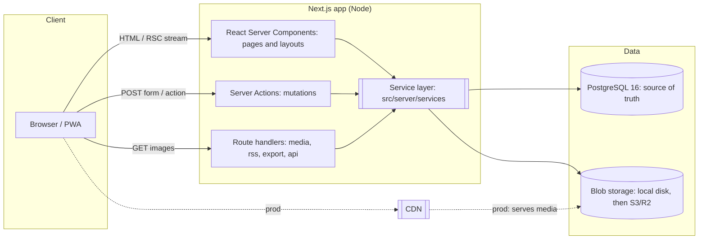
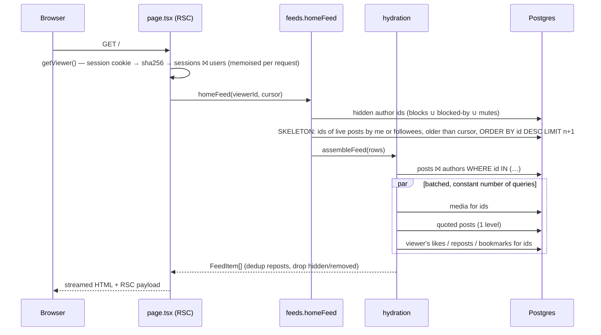
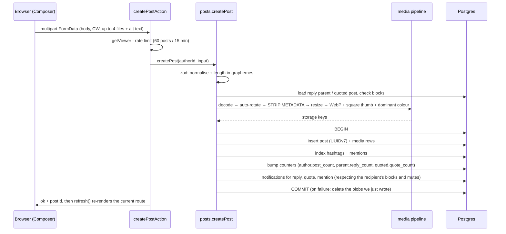
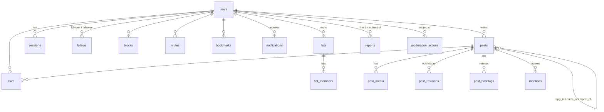
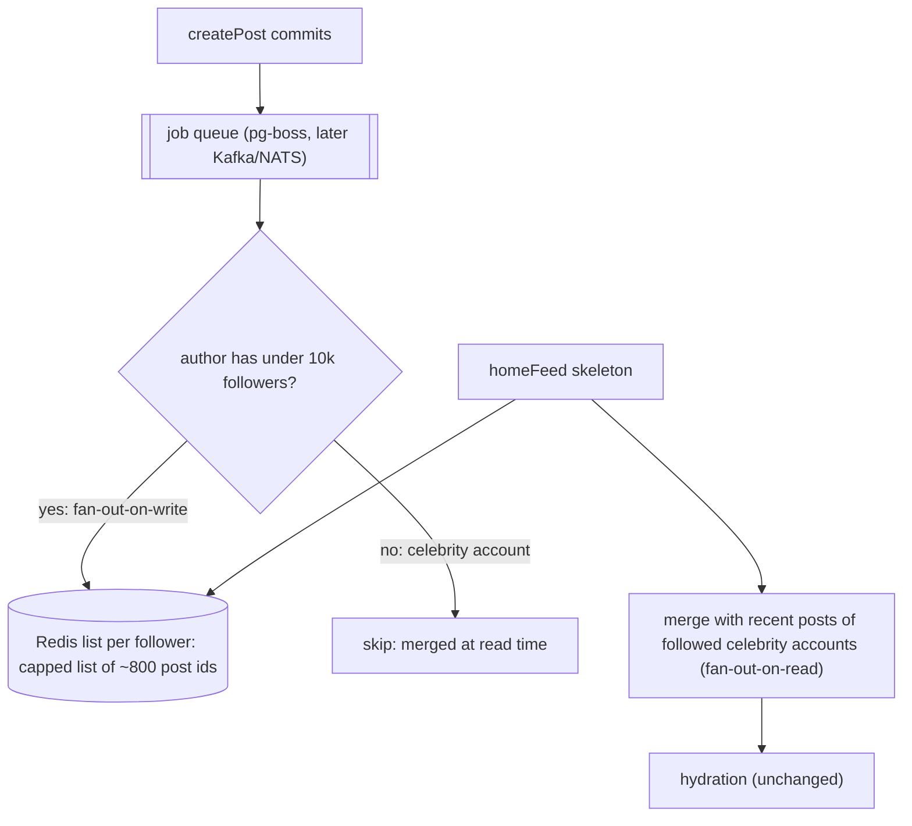
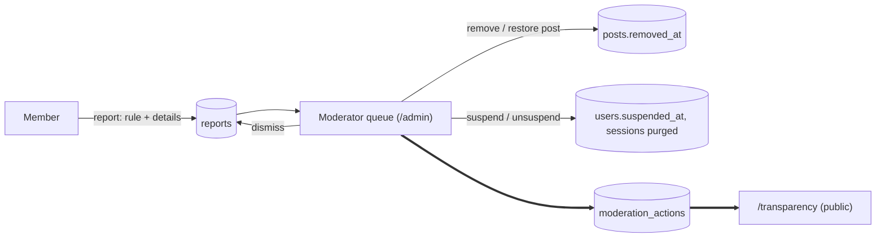

# NoElons architecture

> How NoElons works today, why it's built this way, and how it grows: from one box to millions of people, and from one
> server to a federated network.

The product promises in the [Charter](../src/lib/rules.ts) are the strongest architectural constraints. They include a
chronological timeline, no paid reach, a public moderation log, and data portability. Many of the decisions below exist
to make those promises cheap to keep and hard to quietly break.

---

## 1. Principles

| Principle | What it means in the code |
| --- | --- |
| **Boring, then clever** | One Postgres, one app process. Every "web-scale" piece (Redis timelines, queues, search cluster) has a documented insertion point but isn't built until a metric demands it. |
| **Chronological is a feature, not a fallback** | Feeds are keyset queries ordered by time-sortable ids. No ranking service exists that could be "tuned" behind members' backs. |
| **Read path ≠ write path** | Writes do the work (counters, indexes, notifications, image processing) so reads are index scans plus batched hydration. |
| **Framework at the edges** | `src/server/services` is plain TypeScript that knows nothing about Next.js. The same code backs pages, server actions, the seed script, the tests, and (later) a public API, workers, and ActivityPub. |
| **Receipts by default** | Edits keep revisions. Moderation writes to a public log. Deletes leave tombstones. |
| **Your data leaves with you** | Export, RSS, and stable URIs are first-class, which also makes federation a natural next step. |

---

## 2. System overview



**Today** this is a *modular monolith*: one deployable plus Postgres plus a directory (or bucket) of images. That's
enough for the first tens of thousands of active members on a single modest machine, and it keeps the whole system
understandable by one person. That matters for a project whose pitch is that nobody can quietly change how it works.

### Code layout

```
src/
  app/                     ← Next.js: routing, pages, layouts, server actions (thin)
    (app)/                 ← the three-column app shell + every in-app page
    (auth)/                ← login / signup
    actions/               ← "use server" entry points: auth, rate-limit, validate, call a service, refresh
    media/[...key]/        ← serves local media (bypassed by a CDN in production)
  components/              ← UI. Server components by default; client islands for interactivity
  server/
    db/                    ← Drizzle schema + client (one pool per process)
    auth/                  ← password hashing, DB sessions, request-scoped viewer
    services/              ← THE DOMAIN: posts, feeds, hydration, relationships, notifications, moderation, lists, export…
    storage/               ← BlobStorage interface + local driver
    media.ts               ← image pipeline (sharp)
    views.ts               ← view models (PostView, UserSummary, …) — the contract between services and UI
  lib/                     ← pure, shared logic: ids, text tokenizer, validation, limits, rules, time
drizzle/                   ← generated SQL migrations (committed)
scripts/                   ← migrate, seed (with a generative-art kit), reset, promote
tests/                     ← vitest: unit tests + service integration tests against real Postgres
```

**Dependency rule:** `app → actions → services → db`. Components may import `services` only from server components.
`lib/` imports nothing app-specific. Services never import `next/*` (the one exception, `auth/viewer.ts`, is the glue
that reads cookies and is never imported by a service).

---

## 3. Request lifecycles

### Read path (e.g. the Home timeline)



Every list in the product goes through this shape: Home, Everyone, Photos, profiles, hashtags, search, lists, bookmarks,
likes, thread replies, and notifications. A feed is a skeleton query (which ids, in what order), then hydration (what
they look like to this viewer). See §6.

### Write path (e.g. posting with photos)



Interactions such as like, repost, and bookmark use the same shape. They are optimistic in the UI and transactional on
the server. Inserts are idempotent (`ON CONFLICT DO NOTHING … RETURNING`), and counters only move when a row actually
changed.

---

## 4. Data model



Conventions:

- **UUIDv7 everywhere** ([ADR 3](adr/0003-uuidv7-keyset-pagination.md)). Ids are generated in the app and sort by
  creation time, so every list paginates with `WHERE id < :cursor ORDER BY id DESC LIMIT n` and never uses `OFFSET`.
  Cursors are just the last id and are validated as UUIDs before they reach SQL. The same trick covers likes, bookmarks,
  follows, and notifications: each edge row gets its own v7 id, so "your likes, newest first" is also a keyset scan.
- **A repost is a post row** with `repost_of_id` and no body, the way Twitter modelled retweets. That makes "posts and
  reposts by people I follow, newest first" a *single* index scan. A partial unique index enforces one repost per
  person per post.
- **Denormalised counters** (`like_count`, `follower_count`, …) are updated in the same transaction as the edge row
  that changes them. `greatest(x - 1, 0)` guards against drift. A nightly reconciliation job is on the roadmap.
- **`reply_to_author_id` is denormalised** so the home timeline can apply the old-Twitter rule (show a reply only if
  you follow the person being replied to) without a join.
- **Soft delete with scrubbing.** Deleting a post sets `deleted_at` and blanks the body, CW, media, revisions, hashtags,
  mentions, and notifications. The row stays as a tombstone so replies keep their context. Moderator removal
  (`removed_at` + `removal_rule`) is separate and reversible, because appeals exist.
- **Lower-cased identity.** Usernames and emails are stored lower-case, which a `CHECK` constraint enforces.
  Display names carry the styling.
- **Search** uses a generated `tsvector` column (`simple` config, so it's language-agnostic) with a GIN index. People
  search uses `pg_trgm` GIN indexes on username and display name.

### Indexes that matter

| Query | Index |
| --- | --- |
| Profile and home skeletons | `posts (author_id, id DESC)` |
| Everyone (public timeline) | partial `posts (id DESC) WHERE live` |
| Photos grid | partial `posts (id DESC) WHERE media_count > 0 AND repost_of_id IS NULL AND live` |
| Thread replies | `posts (reply_to_id, id)` |
| Hashtag pages | `post_hashtags (tag, post_id DESC)` |
| Trends (24h window) | `post_hashtags (created_at)` |
| "Do I follow X?" (home + fan-out) | unique `follows (follower_id, followee_id)` |
| Unread badge | partial `notifications (recipient_id) WHERE read_at IS NULL` |

The home timeline query plans as an index scan over `posts_live_idx`, probing a memoised index-only lookup into
`follows_pair_uq`. On the seed data it executes in about 0.25 ms.

---

## 5. Timelines: today and at scale

**Today: fan-out-on-read.** `homeFeed` asks Postgres for the newest live posts whose author is you or someone you
follow. With the indexes above, this stays fast while follow counts and post volume are moderate. It's also trivially
correct: blocks, mutes, deletes, and moderator removals apply instantly because nothing is precomputed.

**When it stops being enough** (rule of thumb: p95 home-skeleton latency above 50 ms, or a few thousand timeline reads
per second), we move to the classic hybrid that Twitter converged on. The skeleton/hydration split (§6) means only the
skeleton step changes.



- Write fan-out pushes post ids (not content) into followers' Redis lists, so a post edit or delete never touches
  timelines. Hydration reads the current truth and drops tombstones.
- Accounts with huge follower counts are excluded from fan-out and merged in at read time. This avoids the write
  amplification that hurt early Twitter.
- Blocks and mutes are applied at hydration time, as they are today, so they take effect instantly even with cached
  timelines.
- **Cold start:** if `timeline:{userId}` is missing (an inactive user, or Redis was flushed), fall back to today's
  fan-out-on-read query and backfill. Today's query never goes away.
- **Chronology is preserved.** The cache holds UUIDv7 ids, and merging sorted id lists keeps strict time order. No
  ranking step exists in the pipeline, by design.

### Optional feeds (roadmap)

The Charter allows *opt-in* feeds with published rules. Architecturally, a feed is just another skeleton generator:
`(viewer, cursor) → ordered post ids`. The plan is to let anyone publish one (as Bluesky does with feed generators),
with members subscribing explicitly. Hydration and moderation still happen on our side, so a third-party feed can
never surface removed or blocked content.

---

## 6. Hydration: skeleton → hydrate → present

`src/server/services/hydration.ts` turns ids into `PostView`s with a **constant number of queries per page**, no
matter the page size:

1. `posts ⨝ users` for the requested ids
2. media for those ids (one query)
3. quoted posts, recursively hydrated **one level** deep (one query plus its own constant set)
4. usernames of reply-to authors (one query)
5. the viewer's likes, reposts, and bookmarks for those ids (three small queries)

It also decides **visibility state** (`ok | deleted | removed | unavailable`). Unavailable covers suspended authors and
anyone in the viewer's block/mute set. Components render tombstones instead of content, and feeds drop non-`ok` items.
Moderators get a `reveal` option to see removed content in the queue.

Why it matters:

- Feeds become interchangeable: SQL today, Redis or a search index or a third-party generator tomorrow.
- Authorisation lives in one place. A new feed can't forget to hide blocked users.
- View models (`src/server/views.ts`) are plain JSON-able objects, the same shapes a public REST API or ActivityPub
  serializer would emit.

---

## 7. Media pipeline

`src/server/media.ts`, via sharp/libvips:

- **Never trust the client:** the format is sniffed from bytes, and input is capped at 10 MB and 60 megapixels.
- `.rotate()` applies EXIF orientation, and then **all metadata is dropped** (GPS, camera serial, …). This is a Charter
  promise.
- Full size is ≤ 2048 px WebP at q82. The grid thumbnail is a 640×640 attention-cropped WebP. The dominant colour is
  stored as a loading placeholder.
- Avatars are 400×400 and banners 1500×500.
- Keys are content-addressed by a fresh UUIDv7 (`p/2026/10/<id>.webp`), so a key's bytes **never change**: a new
  upload always gets a new key, and caches never serve a stale version. *Availability* can change, though. Before
  serving a post photo, `/media` checks that its post isn't deleted or removed and its author isn't suspended. Responses
  are cached for a day. In production, the moderation action also purges the key from the CDN (a hook on
  `removePost`/`suspendUser`).
- Storage sits behind a 4-method `BlobStorage` interface. `LocalStorage` writes to `MEDIA_DIR` and serves via
  `/media/*` with a locked-down CSP. In production, an S3-compatible driver (R2, S3, MinIO) plus a CDN replaces it,
  with `MEDIA_PUBLIC_BASE_URL` pointing at the CDN so the app never proxies image bytes.
- Processing happens synchronously in the request. That's fine for photos (≈100–300 ms). Video will need a job queue
  and transcoding workers, and the queue goes in at that point.

---

## 8. Search, trends, discovery

- **Post search:** `websearch_to_tsquery('simple', q)` against the generated `tsvector`, newest first (we don't rank
  by engagement). Quoted phrases and `-exclusions` work for free. When the corpus outgrows Postgres FTS, the skeleton
  step moves to OpenSearch or Meilisearch, and hydration is unchanged.
- **Trends:** hashtags ranked by **distinct people** in the last 24 hours, then by post count. Counting people rather
  than posts makes trends far harder to game with one spammy account. The result is cached in-process for 60 seconds;
  at scale this becomes a Redis sorted set or a materialised view refreshed each minute. The rule is printed under the
  widget, because that's the whole algorithm.
- **Who to follow:** friends-of-friends, falling back to the most-followed accounts. It's deterministic and explainable.

---

## 9. Notifications

- Written inside the transaction that caused them (`notify()`), and skipped when the recipient has blocked or muted the
  actor. Undoing the cause (unlike, unrepost, unfollow, delete) deletes the notification, so like/unlike spam can't
  flood anyone.
- Read side: grouping happens at presentation time ("Lena and 3 others liked your post"). Replies, quotes, and mentions
  are always shown individually because they're conversations.
- The unread badge polls an indexed `COUNT` (`/api/notifications/unread`) on navigation and every 60 seconds. Upgrade
  path: SSE from a small fan-out service subscribed to Postgres `LISTEN/NOTIFY`, later Redis pub/sub, plus Web Push for
  the PWA.

---

## 10. Moderation and transparency



- Reports must cite a **rule code** from `src/lib/rules.ts`. Codes are stable identifiers: new ones are appended,
  never renumbered.
- Every action, including dismissals, appends to `moderation_actions`. `/transparency` renders it publicly with 30-day
  aggregates by rule. Moderator ids are stored for internal audit but **never** returned by the public query.
- Removal is reversible (appeals) and distinct from author deletion. Suspension purges sessions immediately, and
  hydration hides the suspended author's content everywhere.
- Moderators can't suspend admins, and only admins can suspend moderators.
- **Roadmap:** an appeals flow, community-elected moderators with term limits, published rule-change proposals with a
  30-day comment period (the Charter process), and composable moderation (subscribe to third-party labelers, as Bluesky
  does).

---

## 11. Security and privacy

| Threat | Mitigation |
| --- | --- |
| Credential theft | argon2id (OWASP params: 19 MiB, t=2). Login timing equalised with a dummy hash for unknown users. |
| Session theft / DB leak | 160-bit random tokens. The DB stores only `sha256(token)`. Cookies are `HttpOnly`, `SameSite=Lax`, and `Secure` when `PUBLIC_URL` is https. 30-day sliding expiry enforced server-side. Password change revokes every session. |
| CSRF | Mutations are Server Actions (POST-only, with Next's built-in Origin/Host check) or same-site cookies. No state-changing GETs. |
| XSS | User text is **tokenized and rendered as React text nodes**, never as HTML. Links get `rel="noopener noreferrer nofollow ugc"`. Media is served with `default-src 'none'`. |
| Open redirects | `?next=` must be a same-origin path (`/x`, not `//x` or `/\x`). |
| Malicious uploads | Re-encoded through libvips with format sniffing and pixel limits. Storage keys are validated against a strict regex and resolved inside the media root. |
| Abuse / brute force | Fixed-window rate limits on login (per IP+account *and* per account), signup, posting, interactions, and reports (in-memory now, Redis when multi-instance). The client IP is taken from `X-Forwarded-For` only at the hop our own proxy appended (`TRUST_PROXY_HOPS`, default 1), so spoofed entries are ignored. Production must run behind a reverse proxy/LB. |
| Races | Counter-changing writes are conditional (`… WHERE deleted_at IS NULL RETURNING`), lists lock their row before membership changes, edits lock the post, and follow/block between the same pair is serialised with a transaction-scoped advisory lock. |
| Clickjacking etc. | `X-Frame-Options: DENY`, `nosniff`, a strict `Referrer-Policy`, and a `Permissions-Policy` that disables camera, mic, geolocation, and FLoC. |
| Location leaks | All photo metadata stripped at upload. |
| Privacy by default | Likes and bookmarks are private, and only the owner sees their Likes tab. Mutes are invisible to the muted. |
| Right to leave | `/settings/export` produces a versioned JSON of everything. Account deletion cascades and fixes other people's counters. |

---

## 12. Scaling roadmap

| Stage | Members (MAU) | Shape | Add when… |
| --- | --- | --- | --- |
| **0: today** | ≤ ~50k | 1 app process + Postgres + disk | — |
| **1** | ~50k–500k | N stateless app replicas behind a load balancer · managed Postgres + 1–2 read replicas (route feed skeleton and hydration reads there) · S3/R2 + CDN for media · Redis for rate limits, trends, sessions cache · pg-boss job queue (notifications fan-out, email, media variants) · nightly counter reconciliation | p95 page > 300 ms, CPU > 60%, or a second instance is needed for availability |
| **2** | ~500k–5M | Redis timelines with hybrid fan-out (§5) · dedicated search (OpenSearch/Meilisearch) fed by logical replication/CDC · SSE/WebSocket gateway for live notifications · separate media workers (video) | Home skeleton p95 > 50 ms or write amplification visible |
| **3** | 5M+ | Partition `posts`, `likes`, and `notifications` by id range (UUIDv7 makes range partitioning natural) · move the fan-out service and feed generators out of the monolith · multi-region read replicas and CDN · federation relays | Single-primary write throughput becomes the bottleneck |

Things we deliberately **don't** do early: microservices, Kafka, GraphQL federation, and Kubernetes operators. Each has
a clear trigger above; until then they cost more in complexity than they return.

---

## 13. Federation (ActivityPub) plan

Making "your data leaves with you" literal means people can follow NoElons accounts from Mastodon, Threads, and the
rest of the fediverse, and move their account elsewhere without losing followers. The current model was chosen with
that in mind:

| ActivityPub concept | NoElons today | To add |
| --- | --- | --- |
| Actor (`Person`) | `users` row, `/@username` | `/users/{id}` actor JSON, RSA/Ed25519 keypair per user, WebFinger at `/.well-known/webfinger` |
| Object (`Note`) | `posts` row, stable `/p/{uuid}` URI | JSON-LD serializer (from `PostView`), `Image` attachments from `post_media` |
| `Create` / `Update` / `Delete` | createPost / editPost (revisions) / tombstones | outbox + signed delivery jobs (HTTP Signatures) via the job queue |
| `Announce` / `Like` / `Follow` | repost rows / likes / follows | inbox handler mapping remote activities onto the same services |
| `Move` | export format v1 | account migration endpoint plus alias verification |

Remote actors become `users` rows with a `domain` column and no password. Remote posts become `posts` rows with an
`ap_id`. Everything downstream (feeds, hydration, moderation, blocks) keeps working unchanged. Instance-level blocks
(defederation) become one more `hiddenAuthorIds`-style filter, and every one of them is published in the transparency
log.

---

## 14. Operations

- **Migrations:** `drizzle-kit generate` turns schema diffs into SQL files committed under `drizzle/`.
  `scripts/migrate.mjs` (plain JS, so it runs in the slim production image) applies them on boot. Migrations must stay
  backwards-compatible with the previous app version (expand, then contract) so rolling deploys work.
- **Backups:** continuous WAL archiving / PITR on the managed Postgres, plus bucket versioning for media. Restores
  are drilled quarterly.
- **Observability:** structured logs from actions (`[action] unexpected error`), Next's OpenTelemetry hook
  (`instrumentation.ts`) for traces, and Postgres `pg_stat_statements` for slow-query review. SLOs: home timeline
  p95 < 300 ms, post publish p95 < 800 ms with photos.
- **Deployment:** the `Dockerfile` builds a slim standalone Next server image that runs migrations, then
  `server.js`. `docker compose --profile full up` runs the whole stack locally. Any container host works (Fly, Render,
  Railway, ECS, k8s).
- **CI:** GitHub Actions runs typecheck, unit and integration tests against a Postgres service container, and a
  production build on every push.

---

## 15. Decision records

- [0001: Modular monolith on Next.js](adr/0001-modular-monolith.md)
- [0002: Postgres is the only stateful dependency (for now)](adr/0002-postgres-only.md)
- [0003: UUIDv7 ids and keyset pagination](adr/0003-uuidv7-keyset-pagination.md)
- [0004: Feeds are skeletons + hydration; fan-out-on-read first](adr/0004-skeleton-hydration-feeds.md)
- [0005: Process media at upload; never-reused keys](adr/0005-media-at-upload.md)
- [0006: A public moderation log](adr/0006-public-moderation-log.md)
- [0007: Database sessions, not JWTs](adr/0007-database-sessions.md)
